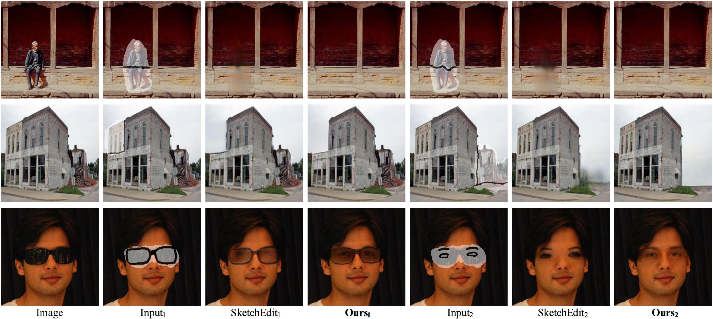
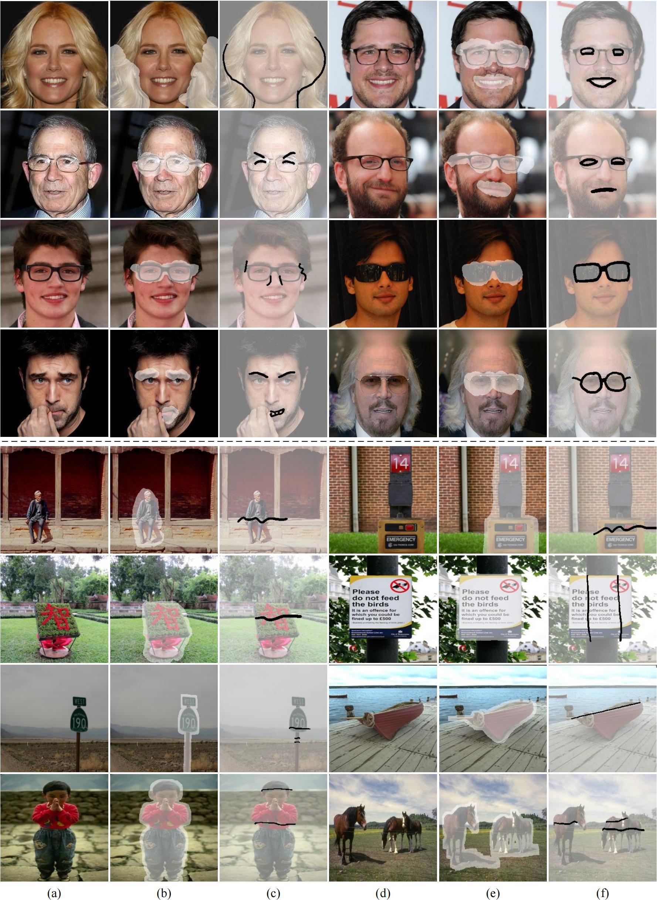
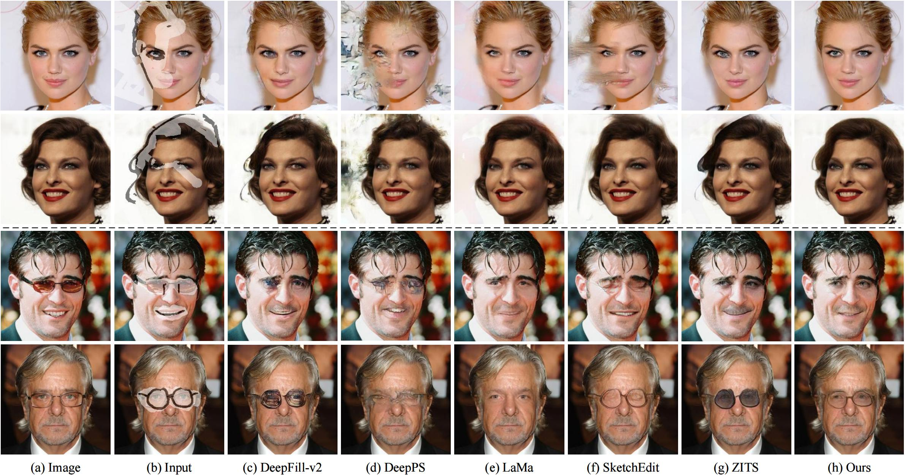
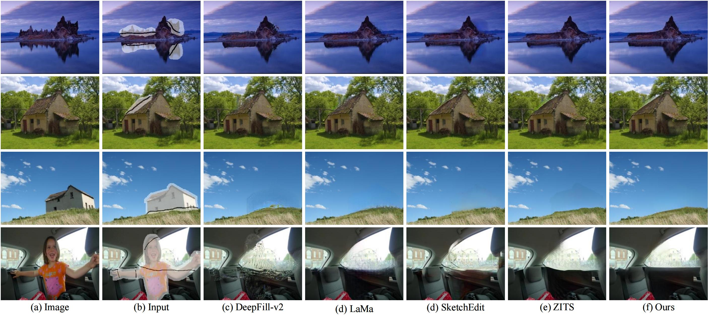

<p align="center">
  <h1 align="center">Towards Interactive Image Inpainting via Sketch Refinement</h1>
The official code implementation of "Towards Interactive Image Inpainting via Sketch Refinement".

[[Paper](https://arxiv.org/abs/2306.00407)] / [[Project](https://alonzoleeeooo.github.io/SketchRefiner/)] / [[Test Protocol](https://pan.baidu.com/s/1avtBkYaOuxm36X-eoQERrw)] / [[Model Weights](https://pan.baidu.com/s/1TAqqwHkjnBoDmfxMl0vl6Q?pwd=skre)] / [Interactive Demo]

*(The password to download the real-world test protocol: rwtp)*

# 🔥News
- [May 17th] Our paper titled ["Towards Interactive Image Inpainting via Robust Sketch Refinement"](https://ieeexplore.ieee.org/document/10533842) is accepted by TMM 2024! 


# Citation
If you find our work is enlightening or the proposed dataset is useful to you, please cite our TMM 2024 paper.
```tex
@ARTICLE{liu-etal-2024-sketchrefiner,
  author={Liu, Chang and Xu, Shunxin and Peng, Jialun and Zhang, Kaidong and Liu, Dong},
  journal={IEEE Transactions on Multimedia}, 
  title={Towards Interactive Image Inpainting via Robust Sketch Refinement}, 
  year={2024},
  pages={1-15},
}
```

# Overview

One tough problem of image inpainting is to restore complex structures in the corrupted regions. It motivates interactive image inpainting which leverages additional hints, e.g., sketches, to assist the inpainting process. Sketch is simple and intuitive to end users, but meanwhile has free forms with much randomness. Such randomness may confuse the inpainting models, and incur severe artifacts in completed images. To address this problem, we propose a two-stage image inpainting method termed SketchRefiner. In the first stage, we propose using a cross-correlation loss function to robustly calibrate and refine the user-provided sketches in a coarse-to-fine fashion. In the second stage, we learn to extract features from the abstracted sketches in a latent space and modulate the inpainting process. We also propose an algorithm to simulate real sketches automatically and build a test protocol to evaluate different methods under real applications. Experimental results on public datasets demonstrate that SketchRefiner effectively utilizes sketch information and eliminates the artifacts due to the free-form sketches. Our method consistently outperforms state-of-the-art baselines both qualitatively and quantitatively, meanwhile revealing great potential in real-world applications.

# To-Do Lists
- [ ] Online demo of SketchRefiner.
- [x] Official instructions for installation and usage of SketchRefiner.
- [x] Training code of SketchRefiner.
- [x] Testing code of SketchRefiner.
- [x] The proposed sketch-based test protocol.
- [x] Pre-trained model weights.

# Prerequisites
For installing the environment, you could execute the following scripts:
```bash
conda create -n sketchrefiner python=3.6
conda activate sketchrefiner
pip install torch==1.9.0+cu111 torchvision==0.10.0+cu111 torchaudio==0.9.0 -f https://download.pytorch.org/whl/torch_stable.html
pip install opencv-python
```

For utilizing the HRF loss to train the model, please download the pre-trained models provided by [LaMa](https://github.com/advimman/lama). You could download the model by executing the following command lines:
```bash
mkdir -p ade20k/ade20k-resnet50dilated-ppm_deepsup/
wget -P ade20k/ade20k-resnet50dilated-ppm_deepsup/ http://sceneparsing.csail.mit.edu/model/pytorch/ade20k-resnet50dilated-ppm_deepsup/encoder_epoch_20.pth
```
Note that the `ade20k` folder is placed at `SIN_src/models/ade20k`.

# Usage
## Data Pre-processing
Before you train all the networks, you need to first prepare all the data following the procedures as follows:
1. Download [ImageNet](https://www.image-net.org/), [CelebA-HQ](https://github.com/tkarras/progressive_growing_of_gans), and [Places2](http://places2.csail.mit.edu/download.html) datasets. Suppose that these data is downloaded at `datasets/dataset_name`.
2. Use the edge detector [BDCN](https://github.com/pkuCactus/BDCN) to extract edge map from the ground truth images in `datasets`. Suppose that the resulting edge maps are placed at `datasets/dataset_name/edges`.
3. Run `scripts/make_deform_sketch.py` to generate the deformed sketches for training. We offer an example command line as follows:
```bash
# generate deformed sketches from detected edge maps
python scripts/make_deform_sketch.py
      --edge datasets/dataset_name/edges
      --output datasets/dataset_name/sketches
```
You may adjust `--grid_size`, `--filter_size`, and `--max_move` to control the magnitude of warping the edge maps. And you can select the number of generated sketches by adjusting `--num_samples`.

## Training
### 1. Train the Sketch Refinement Network (SRN)
Before training the inpainting network of SketchRefiner, you need to first train the proposed Sketch Refinement Network (SRN). We demonstrate an example command line as follows:

```bash
# train the Registration Module (RM)
python SRN_train.py
      --images /path/to/images
      --edges_prefix /path/to/edge
      --output /path/to/output/dir
      
# train the Enhancement Module (EM)
python SRN_train.py
      --images /path/to/images/
      --edges_prefix /path/to/edge/
      --output /path/to/output/dir
      --train_EM
      --RM_checkpoint /path/to/model/weights/of/RM
```

If you need to evaluate the model during training, make sure you assign `val_interval > 0` and configure the paths of `images_val`, `masks_val`, `sketches_prefix_val`, `edges_prefix_val`.

### 2. Train the Sketch-modulated Inpainting Network (SIN)
After the SRN is trained, you could start training the SIN by executing:
```bash
python SIN_train.py
      --config_path /path/to/config
      --GPU_ids gpu_id
```
Make sure you modify corresponding lines of the configuration file with the paths of training data. We put an example configuration file in `SIN_src/configs/example.yml`.

## Inference
### 3. Refine the Input Sketches
During inference, you need to first refine the input sketches and save them locally by running:
```bash
python SRN_test.py
      --images /path/to/test/source/images
      --masks /path/to/test/masks
      --edge_prefix /path/to/detected/edges
      --sketch_prefix /path/to/input/sketches
      --output /path/to/output/dir
      --RM_checkpoint /path/to/RM/checkpoint
      --EM_checkpoint /path/to/EM/checkpoint
```
The refined sketches would be saved at the assigned `output` path.

### 4. Inpaint the Corrupted Images with Refined Sketches
Now you could inpaint the corrupted images with the refined sketches from SRN, by running:
```bash
python SIN_test.py
      --config_path /path/to/config/path
      --GPU_ids gpu_id
      --images /path/to/source/images
      --masks /path/to/masks
      --edges /path/to/detected/edges
      --sketches /path/to/input/sketches
      --refined_sketches /path/to/refined/sketches
      --output /path/to/output/dir/
      --checkpoint /path/to/model/weights/of/SIM
      --num_samples maximum_samples
```
Edges are detected using bdcn, you could refer to their code in [here](https://github.com/pkuCactus/BDCN).

## Pre-trained Model Weights
We release the pre-trained model weights of SketchRefiner on CelebA-HQ, Places2, and ImageNet, which can be referred to in [here](https://pan.baidu.com/s/1TAqqwHkjnBoDmfxMl0vl6Q?pwd=skre) (password: skre).

## Real-World Test Protocol
We release the curated real-world test protocol, which currently consists of 26 face images and 60 natural images with manually annotated masks and sketches. Note that the current released version might be further revised until our paper is finally accepted. You may download the test protocol in [here](https://pan.baidu.com/s/1avtBkYaOuxm36X-eoQERrw) (password: rwtp).

We provide some examples of the test protocol in the following figure. <details>
<summary>Examples of Real-World Test Protocol</summary>



</details>

# Qualitative Comparisons
We demonstrate the qualitative comparisons upon face and natural images in the following figures. 
<details><summary>Face Images</summary>



</details>

<details><summary>Natural Images</summary>



</details>

<details><summary>More Results</summary>


</details>

# License
This work is licensed under MIT license. See the [LICENSE](LICENSE) for details.

# Acknowledgements
This codebase is heavily modified from [ZITS](https://github.com/DQiaole/ZITS_inpainting). Thanks for their great implementaion!

[](https://github.com/AlonzoLeeeooo/SketchRefiner/stargazers)

[](https://github.com/AlonzoLeeeooo/SketchRefiner/network/members)

<p align="center">
    <a href="https://api.star-history.com/svg?repos=AlonzoLeeeooo/SketchRefiner&type=Date" target="_blank">
        
    </a>
<p>